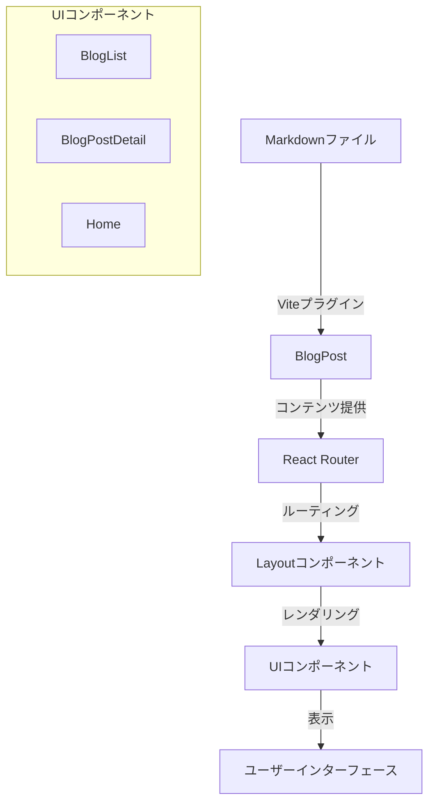
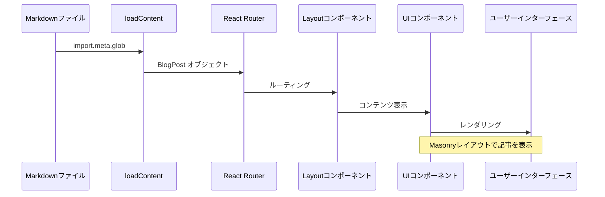

# システムパターン

## アーキテクチャ概要



## コアコンポーネント

### 1. コンテンツ管理システム
- **場所**: `src/contents/*.md`
- **役割**: ブログ記事のソース
- **特徴**:
  - マークダウン形式で記事を管理
  - Front Matterでメタデータを定義

### 2. コンテンツローダー
- **場所**: `src/loadContent.ts`
- **役割**: マークダウンファイルの読み込みと変換
- **主要機能**:
  - Viteの`import.meta.glob`を使用したファイル読み込み
  - マークダウンのReactコンポーネントへの変換
- **戻り値**: `Record<string, BlogPost>`型のオブジェクト

### 3. 型定義
- **場所**: `src/types/BlogPost.ts`
- **主要型**:
  ```typescript
  interface BlogPost {
      attributes?: Record<string, string>  // メタデータ
      ReactComponent: React.FunctionComponent  // 記事コンポーネント
  }
  ```

### 4. UIコンポーネント
- **場所**: `src/components/`
- **主要コンポーネント**:
  - `Layout.tsx`: アプリケーションの基本レイアウト
  - `BlogList.tsx`: ブログ記事一覧（Masonryレイアウト）
  - `BlogPostDetail.tsx`: 個別記事の表示
  - `Home.tsx`: ホームページ
  - `Navigation.tsx`: ナビゲーションメニュー

### 5. ルーティング
- **場所**: `src/routes/index.tsx`
- **責務**:
  - URLベースのナビゲーション
  - コンポーネントの条件付きレンダリング
  - パラメータによる記事の特定

## データフロー



## 採用している設計パターン

### 1. 単一責任の原則
- 各コンポーネントは明確に定義された単一の責務を持つ
- コンテンツの読み込み、表示、状態管理が分離されている

### 2. 宣言的UI
- Reactの宣言的なUIパターンを採用
- コンポーネントベースのアーキテクチャ

### 3. 型安全性
- TypeScriptによる静的型チェック
- インターフェースを通じた明確な契約

## 拡張ポイント

1. コンテンツ機能
   - カテゴリー/タグページの追加
   - 記事の検索機能実装
   - 記事のメタ情報の拡充

2. 状態管理
   - より複雑な状態管理が必要な場合の対応
   - キャッシュ戦略の実装
   - ダークモード設定の永続化

3. UIの改善
   - アニメーションの追加
   - レスポンシブデザインの最適化
   - アクセシビリティの向上

4. ビルドとデプロイ
   - ビルド最適化の追加
   - デプロイプロセスの自動化
   - パフォーマンスモニタリングの導入
