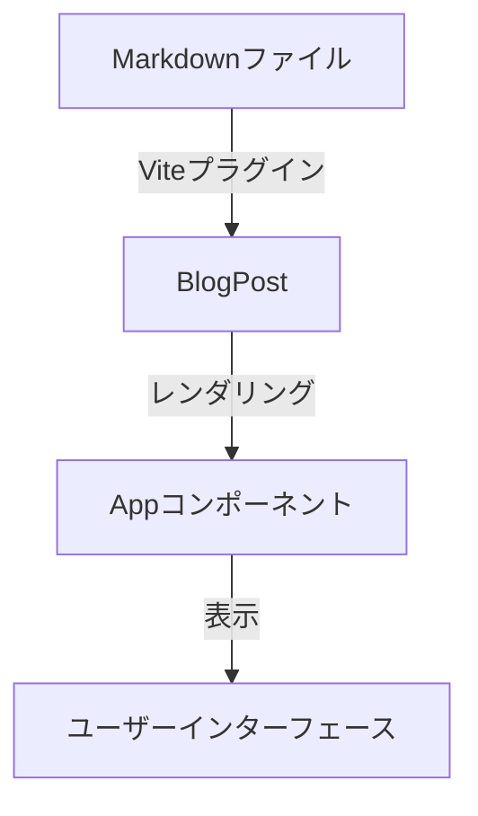
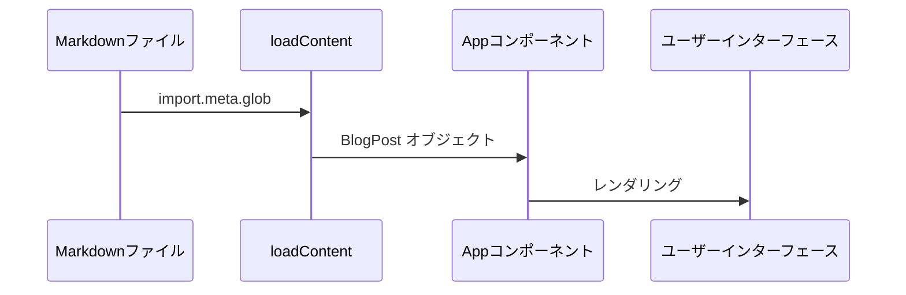

# システムパターン

## アーキテクチャ概要



## コアコンポーネント

### 1. コンテンツ管理システム
- **場所**: `src/contents/*.md`
- **役割**: ブログ記事のソース
- **特徴**:
  - マークダウン形式で記事を管理
  - Front Matterでメタデータを定義

### 2. コンテンツローダー
- **場所**: `src/loadContent.ts`
- **役割**: マークダウンファイルの読み込みと変換
- **主要機能**:
  - Viteの`import.meta.glob`を使用したファイル読み込み
  - マークダウンのReactコンポーネントへの変換
- **戻り値**: `Record<string, BlogPost>`型のオブジェクト

### 3. 型定義
- **場所**: `src/types/BlogPost.ts`
- **主要型**:
  ```typescript
  interface BlogPost {
      attributes?: Record<string, string>  // メタデータ
      ReactComponent: React.FunctionComponent  // 記事コンポーネント
  }
  ```

### 4. メインアプリケーション
- **場所**: `src/App.tsx`
- **責務**:
  - コンテンツの読み込み
  - 記事一覧の表示
  - ユーザーインタラクションの処理

## データフロー



## 採用している設計パターン

### 1. 単一責任の原則
- 各コンポーネントは明確に定義された単一の責務を持つ
- コンテンツの読み込み、表示、状態管理が分離されている

### 2. 宣言的UI
- Reactの宣言的なUIパターンを採用
- コンポーネントベースのアーキテクチャ

### 3. 型安全性
- TypeScriptによる静的型チェック
- インターフェースを通じた明確な契約

## 拡張ポイント

1. ルーティング
   - 記事の個別ページ表示
   - カテゴリー/タグページの追加

2. 状態管理
   - より複雑な状態管理が必要な場合の対応
   - キャッシュ戦略の実装

3. コンポーネント構造
   - UIコンポーネントの分割
   - 共通コンポーネントの抽出

4. ビルドプロセス
   - 最適化の追加
   - デプロイプロセスの自動化
